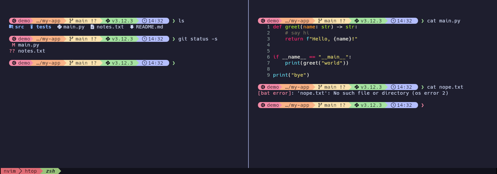
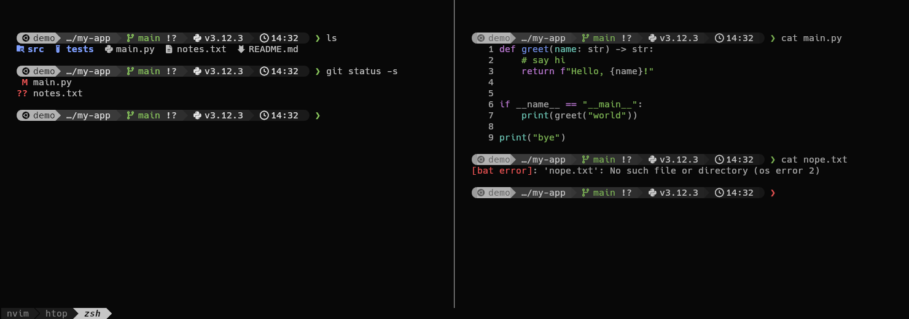
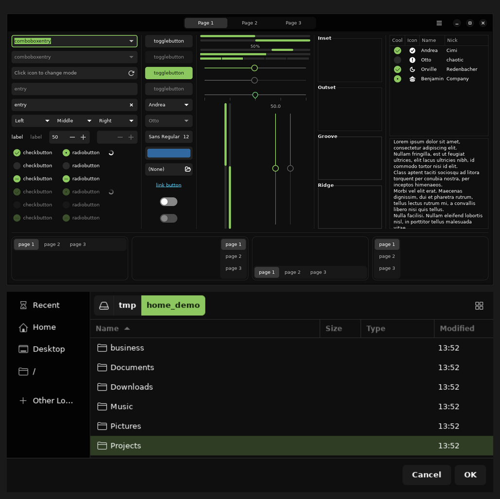

<h3 align="center">
	<br/>
	
	A themed <a href="https://github.com/kovidgoyal/kitty">Kitty</a> & <a href="https://starship.rs">Starship</a> workspace, in Classic (Catppuccin) or Moonfly
	
</h3>


# Auto-Kitty-Workspace
<p>
	Automates the installation and configuration of a fully themed workspace environment in the <b>Kitty</b> terminal. Pick the original <b>Classic</b> (Catppuccin) look or the dark, minimal <b>Moonfly</b> look during install.<br/>
</p>


## Features

- **Two themes to choose from:** Classic (Catppuccin, rainbow prompt) or Moonfly (black, gray prompt, green accents).  
- **ZSH** with a **Starship** prompt that matches the theme.  
- **FZF** for an improved terminal search experience.  
- **Neovim** with the **NvChad** configuration.  
- **Custom shortcuts** for a faster workflow.  
- **Optional Moonfly desktop theme** for Linux Mint Cinnamon (windows, panel, icons).  
- **Switch themes later** on an existing install, without reinstalling.  

> Compatible with any Debian-based distribution.  
> Tested on **Linux Mint 22.3 (Zena)** and **Ubuntu 24.04 (Noble Numbat)**.


## Installation

> **Requirements:** Git and Python 3 must be installed.

```bash
git clone https://github.com/obezeq/Auto-Kitty-Workspace.git ~/Auto-Kitty-Workspace
cd ~/Auto-Kitty-Workspace
python3 main.py
````

The installer first asks which theme you want:

```
Elige el estilo del workspace:

  [1] Classic  Catppuccin pastel + prompt arcoíris (el Auto-Kitty original)
  [2] Moonfly  Negro con acentos verdes: prompt gris, bordes y pestañas neutras
```

If you pick **Moonfly** on Linux Mint Cinnamon, it also asks whether to apply the matching desktop theme.

You can skip the questions with flags:

```bash
python3 main.py --theme classic                 # original look
python3 main.py --theme moonfly --desktop       # Moonfly terminal + Moonfly desktop
python3 main.py --theme moonfly --no-desktop    # Moonfly terminal only
```


## Themes

### [1] Classic

The original Auto-Kitty look: Catppuccin Mocha colors, the pastel rainbow Starship prompt, and red/green tabs.



### [2] Moonfly

A dark, minimal look based on [Moonfly](https://github.com/bluz71/vim-moonfly-colors): black background, a gray gradient prompt, and green used only where it means something (your git branch, and the prompt arrow, which turns red when a command fails). Split borders and tabs are gray and white, and inactive splits are slightly dimmed so you always know which one you're typing in.



Moonfly also sets NvChad to its closest theme (`yoru`) and makes `bat` (your `cat`) use the terminal's Moonfly colors.

### What each theme changes

| | Classic | Moonfly |
| --- | --- | --- |
| Kitty colors | Catppuccin Mocha | Moonfly |
| Tabs and split borders | Red/green tabs, lavender borders | White/gray tabs, gray borders |
| Starship prompt | Pastel rainbow | Gray gradient, green branch and arrow |
| NvChad theme | `onedark` (default) | `yoru` |
| `bat` / `cat` colors | bat default | Terminal (Moonfly) colors |
| Desktop (Cinnamon) | Unchanged | Optional Moonfly desktop |

The theme files live in `tools/themes/<theme>/` (`color.ini` for kitty, `starship.toml` for the prompt), so adding a new theme is just adding a folder and an entry in `THEMES` in `main.py`.

### Switching theme on an existing install

No need to reinstall. From the repo folder:

```bash
python3 main.py --switch-theme moonfly
python3 main.py --switch-theme classic
```

This backs up your current kitty and prompt config to `~/.config/auto-kitty/backup-<date>/`, swaps the colors and prompt (for your user and root), updates NvChad and `bat`, and keeps any keybindings you added to `kitty.conf` (including the optional Super+arrow block). It also updates older installs, removing colors that used to be hardcoded in `kitty.conf`. Press <kbd>Ctrl</kbd>+<kbd>Shift</kbd>+<kbd>F5</kbd> in kitty to reload.

Switching to Moonfly asks about the desktop theme (Cinnamon only); switching back to Classic offers to restore your original Mint desktop.

### Moonfly desktop (Linux Mint Cinnamon, optional)



`tools/desktop/apply-desktop.sh` (run for you by the installer when you say yes) builds the [Colloid](https://github.com/vinceliuice/Colloid-gtk-theme) theme with:

* a pure black background and Moonfly's exact green (`#8cc85f`) as the only accent,
* plain gray window buttons instead of colored dots,
* a solid black panel (the same black as the terminal),
* [Papirus-Dark](https://github.com/PapirusDevelopmentTeam/papirus-icon-theme) icons with gray folders,
* small taskbar badges: green window count and red notifications, on black.

It saves your current desktop look the first time it runs and prints an undo command (`bash ~/theme-backup-desktop-<date>/restore.sh`). It's safe to run again; the undo always returns to your original look.

Change the taskbar badges anytime (size 8-14, `black` or `colored`):

```bash
bash tools/desktop/set-badges.sh 11 black
```


## Script Overview

The installation script performs the following tasks:

* **Kitty installation & configuration** — Sets up the terminal with the theme you pick (Classic or Moonfly) and keyboard shortcuts.
* **Starship + ZSH setup** — Installs a fast, customizable shell prompt (matching your theme) with helpful plugins.
* **Neovim (NvChad)** — Sets up a modern, modular development environment.
* **FZF** — Adds fuzzy finding for commands, files, and history.
* **Plugins & utilities** — Installs `zsh-autosuggestions`, `zsh-syntax-highlighting`, `bat`, `lsd`, and more.
* **Moonfly desktop (optional)** — Themes the Cinnamon desktop to match the Moonfly terminal.


## Important Notes

* **Log out and log back in** after installation so the default-shell change to zsh takes effect. To preview it in the current terminal without a re-login, run `exec zsh`.
* The installer automatically backs up any existing `~/.zshrc`, `~/.config/kitty/`, and `~/.config/starship.toml` with a `.backup.<timestamp>` suffix.
* The installer registers kitty's `xterm-kitty` terminfo system-wide (via `tic`) so tmux, ssh-to-self, and `less` work without "unknown terminal type" errors. The `.zshrc` also exports `TERMINFO_DIRS` as a fallback.
* Hack Nerd Font is downloaded and installed automatically; the installer aborts if `fc-list` doesn't see it afterward (so you don't end up with prompt glyphs rendering as boxes).
* Any phase failure now aborts the installer immediately with a clear message naming the failed step (no more silent partial installs).
* Re-running the script is safe — it backs up configs, skips already-installed fonts, and reuses existing clones.
* The chosen theme is saved in `~/.config/auto-kitty/theme`.
* If `nvim` shows deprecation warnings on first launch (e.g. `vim.lsp.get_active_clients` was removed in Neovim 0.12), run `:Lazy sync` inside Neovim once — NvChad's starter tracks upstream Neovim releases but the first run after a major version bump can occasionally lag a release behind.


## Descriptions

| Component                   | Description                                                     |
| --------------------------- | --------------------------------------------------------------- |
| **Kitty**                   | Fast, GPU-accelerated terminal emulator for advanced users.     |
| **Starship**                | Minimal, fast, and customizable shell prompt written in Rust.   |
| **ZSH**                     | Developer-friendly shell with extensive plugin support.         |
| **FZF**                     | Command-line fuzzy finder for files, history, and more.         |
| **NvChad**                  | Neovim configuration framework focused on speed and modularity. |
| **Zsh-autosuggestions**     | Suggests commands from history as you type.                     |
| **Zsh-syntax-highlighting** | Highlights shell commands in real time.                         |
| **bat**                     | Enhanced `cat` with syntax highlighting and pagination.         |
| **lsd**                     | Modern `ls` replacement with icons and colors.                  |
| **Neovim**                  | Modern text editor based on Vim, built for extensibility.       |


## Custom Keyboard Shortcuts — Kitty Terminal

These shortcuts are configured in `kitty.conf` and help optimize navigation and workflow.


### Window Navigation & Splits

| Keys                                                                  | Action                                            | Description                                     |
| --------------------------------------------------------------------- | ------------------------------------------------- | ----------------------------------------------- |
| <kbd>Super</kbd> + <kbd>H</kbd>/<kbd>J</kbd>/<kbd>K</kbd>/<kbd>L</kbd> | `neighboring_window left/down/up/right`           | Move focus between splits (Vim-style).          |
| <kbd>Super</kbd> + <kbd>←</kbd>/<kbd>↓</kbd>/<kbd>↑</kbd>/<kbd>→</kbd> | `neighboring_window …`                            | Move focus between splits (arrow alias).        |
| <kbd>F5</kbd>                                                         | `launch --location=hsplit`                        | Create a horizontal split in the current dir.   |
| <kbd>F6</kbd>                                                         | `launch --location=vsplit`                        | Create a vertical split in the current dir.     |
| <kbd>Ctrl</kbd> + <kbd>Shift</kbd> + <kbd>←</kbd>/<kbd>→</kbd>/<kbd>↑</kbd>/<kbd>↓</kbd> | `resize_window narrower/wider/taller/shorter 3` | Resize the active split by 3 cells.        |
| <kbd>F7</kbd>                                                         | `start_resizing_window`                           | Enter interactive resize mode (Esc to exit).    |

> <kbd>Super</kbd> + <kbd>Shift</kbd> + arrows to **move** (swap) the active split with its neighbour is **opt-in** — run `python3 tools/keybindings/apply_super_arrows.py` once after the installer to free up Cinnamon's tiling shortcuts and append the matching kitty bindings. See the "Optional: Super+arrow split keybindings" section below.


### Copy & Paste Between Buffers

| Keys          | Action                | Description                     |
| ------------- | --------------------- | ------------------------------- |
| <kbd>F1</kbd> | `copy_to_buffer a`    | Copy selection to **Buffer A**. |
| <kbd>F2</kbd> | `paste_from_buffer a` | Paste from **Buffer A**.        |
| <kbd>F3</kbd> | `copy_to_buffer b`    | Copy selection to **Buffer B**. |
| <kbd>F4</kbd> | `paste_from_buffer b` | Paste from **Buffer B**.        |


### Window & Tab Management

| Keys                                                  | Action                | Description                                     |
| ----------------------------------------------------- | --------------------- | ----------------------------------------------- |
| <kbd>Ctrl</kbd> + <kbd>Shift</kbd> + <kbd>Z</kbd>     | `toggle_layout stack` | Switch to **stacked window mode**.              |
| <kbd>Ctrl</kbd> + <kbd>Shift</kbd> + <kbd>Enter</kbd> | `new_window_with_cwd` | Open a new **window** in the current directory. |
| <kbd>Ctrl</kbd> + <kbd>Shift</kbd> + <kbd>T</kbd>     | `new_tab_with_cwd`    | Open a new **tab** in the current directory.    |


### Command History

| Keys                           | Description                          |
| ------------------------------ | ------------------------------------ |
| <kbd>Ctrl</kbd> + <kbd>R</kbd> | Search and navigate command history. |


## Optional: Super+arrow split keybindings (Cinnamon only)

The base installer ships a kitty config that already binds `Super+HJKL` for split navigation, which works on any desktop environment. If you also want **`Super+Arrows`** to move focus between splits and **`Super+Shift+Arrows`** to swap the active split with its neighbour, you need to free up those keys on the Cinnamon side first (by default Cinnamon binds them to window-tiling and move-to-monitor).

After running `python3 main.py`, run:

```bash
python3 tools/keybindings/apply_super_arrows.py
```

That script:

1. Clears the eight Cinnamon `push-tile-*` / `move-to-monitor-*` shortcuts via `gsettings` so kitty can receive the keys.
2. Appends the `super+shift+arrow → move_window` mappings to your installed `~/.config/kitty/kitty.conf` (idempotently — re-running won't duplicate the block).

It refuses to run on non-Cinnamon desktops (GNOME/KDE/XFCE), where you'd clear the equivalent shortcuts manually instead. Reopen kitty (or run `kitty @ load-config` inside a kitty window) afterward to pick up the new mappings.


## Credits

| Component          | Author     | Link                                    |
| ------------------ | ---------- | --------------------------------------- |
| **Script**         | Juanfu224  | [GitHub](https://github.com/Juanfu224)  |
| **Powerlevel10k**  | romkatv    | [GitHub](https://github.com/romkatv)    |
| **bat**            | sharkdp    | [GitHub](https://github.com/sharkdp)    |
| **lsd**            | Peltoche   | [GitHub](https://github.com/Peltoche)   |
| **Hack Nerd Font** | ryanoasis  | [GitHub](https://github.com/ryanoasis)  |
| **FZF**            | junegunn   | [GitHub](https://github.com/junegunn)   |
| **Neovim**         | Neovim     | [GitHub](https://github.com/neovim)     |
| **Kitty**          | kovidgoyal | [GitHub](https://github.com/kovidgoyal) |
| **Catppuccin**     | Catppuccin | [GitHub](https://github.com/catppuccin) |
| **Moonfly**        | bluz71     | [GitHub](https://github.com/bluz71)     |
| **Colloid theme**  | vinceliuice | [GitHub](https://github.com/vinceliuice) |
| **Papirus icons**  | PapirusDevelopmentTeam | [GitHub](https://github.com/PapirusDevelopmentTeam) |
| **Starship**       | Starship   | [GitHub](https://github.com/starship)   |

> Inspired by **S4vitar** and **Yorkox0** ❤️


